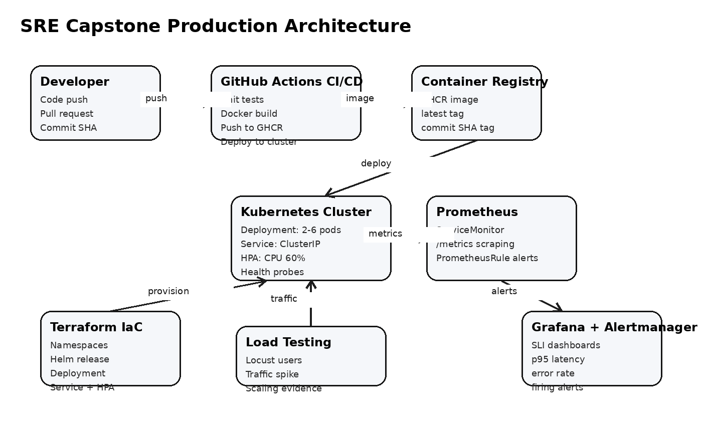

# Technical Report: SRE Capstone Project - Production Readiness Review

**Project:** Shop SRE API - Production-Ready Microservice Infrastructure  
**Team Members:** Mukhametkali Dias, Qaldyqan Yerzat  
**Submission Type:** Group project report, GitHub repository, live presentation and defense  
**Main Technologies:** Terraform, Docker, Kubernetes, GitHub Actions, Prometheus, Grafana, Alertmanager, Locust

## 1. Executive Summary

This project presents a Production Readiness Review (PRR) for a small e-commerce microservice called `shop-sre-api`. The service provides product browsing and checkout functionality and is prepared for production-style operation using SRE practices. The infrastructure is reproducible through Terraform, the application is packaged with Docker, CI/CD is automated through GitHub Actions, and runtime reliability is measured through Prometheus metrics, Grafana dashboards, Alertmanager alerts, SLOs, autoscaling, and load testing.

The project focuses not only on deploying an application, but also on proving that the service can be operated responsibly. For that reason, the repository includes Kubernetes health checks, resource requests and limits, a HorizontalPodAutoscaler, Prometheus scraping configuration, alerting rules, a Grafana dashboard, a Locust load test, an SRE runbook, and defense notes.

## 2. Team Roles and Contribution

Although the original task describes groups of 3-4, this submission is prepared by a two-person SRE team. The work is divided clearly, but both members must be able to explain every part during the defense.

| Team Member | Role | Main Contribution |
|---|---|---|
| Mukhametkali Dias | Incident Commander / CI-CD Engineer | GitHub Actions workflow, Docker image lifecycle, deployment validation, defense explanation |
| Qaldyqan Yerzat | Operations / Observability Engineer | Terraform infrastructure, Kubernetes manifests, Prometheus/Grafana configuration, alerts, load testing |

## 3. Service Description

The selected service is a small e-commerce API. It was chosen because it fits the PRR scenario: an e-commerce platform has user-facing availability requirements, checkout reliability requirements, and measurable latency targets.

Main endpoints:

| Endpoint | Method | Purpose |
|---|---:|---|
| `/` | GET | Service metadata and version |
| `/healthz` | GET | Liveness health check |
| `/readyz` | GET | Readiness health check |
| `/products` | GET | Returns available products |
| `/checkout` | POST | Simulates checkout operation |
| `/slow` | GET | Demo endpoint for latency testing |
| `/cpu` | GET | CPU-bound endpoint for autoscaling tests |
| `/metrics` | GET | Prometheus metrics endpoint |

The application exports the following metrics:

| Metric | Type | Purpose |
|---|---|---|
| `http_requests_total` | Counter | Request count by method, path, and status |
| `http_request_duration_seconds` | Histogram | Request latency distribution |
| `http_requests_in_progress` | Gauge | Current in-progress requests |
| `checkout_requests_total` | Counter | Checkout results by success/error type |
| `shop_inventory_items` | Gauge | Current demo inventory by SKU |

## 4. Architecture

The architecture uses a typical SRE flow: developers push code, CI/CD validates and builds it, the container image is stored in a registry, Kubernetes runs the service, and Prometheus/Grafana observe service behavior.



Key components:

1. **Application layer:** FastAPI service with Prometheus metrics.
2. **Container layer:** Docker image built from a minimal Python runtime image.
3. **Deployment layer:** Kubernetes Deployment, Service, probes, resource limits, and HPA.
4. **Infrastructure layer:** Terraform provisions namespaces, app resources, and the monitoring stack.
5. **CI/CD layer:** GitHub Actions tests, builds, pushes, and deploys.
6. **Observability layer:** Prometheus scrapes metrics, Grafana visualizes SLIs, and Alertmanager handles alerts.
7. **Testing layer:** Locust generates traffic spikes to validate scaling and SLO behavior.

## 5. Infrastructure as Code

Terraform is used as the Infrastructure as Code tool. It provisions the following resources:

- `sre-prr` namespace for the application.
- `monitoring` namespace for Prometheus, Grafana, and Alertmanager.
- kube-prometheus-stack Helm release.
- Application Deployment.
- Application Service.
- HorizontalPodAutoscaler.

Terraform files are stored in the `terraform/` directory:

| File | Purpose |
|---|---|
| `versions.tf` | Required Terraform version, providers, and local backend |
| `providers.tf` | Kubernetes and Helm provider configuration |
| `variables.tf` | Variables for image, namespace, replicas, and kubeconfig |
| `main.tf` | Main infrastructure resources |
| `outputs.tf` | Useful access commands after deployment |
| `terraform.tfvars.example` | Safe example variable file |
| `values-kube-prometheus.yaml` | Helm values for Prometheus/Grafana stack |

State management is handled through a local backend at `terraform/state/sre-prr.tfstate`. The state path is excluded from Git by `.gitignore`, so Terraform state is not committed to the public repository. This is acceptable for a course/local demonstration. In a real production environment, a remote backend such as Terraform Cloud, S3 with locking, or another team-managed backend would be preferred.

Reproducibility command sequence:

```bash
cd terraform
cp terraform.tfvars.example terraform.tfvars
terraform init
terraform fmt
terraform validate
terraform plan
terraform apply
```

## 6. CI/CD Pipeline

The CI/CD pipeline is implemented with GitHub Actions in `.github/workflows/ci-cd.yml`.

Pipeline stages:

1. Checkout repository.
2. Install Python 3.11.
3. Install application dependencies.
4. Run unit tests with pytest.
5. Log in to GitHub Container Registry.
6. Build Docker image.
7. Push image with `latest` and commit SHA tags.
8. Configure `kubectl` using `KUBE_CONFIG_B64` secret.
9. Apply Kubernetes manifests.
10. Update deployment image.
11. Verify rollout status.

The pipeline supports traceability because each image can be tagged with the Git commit SHA. If a deployment fails, Kubernetes rollout history can be used to return to a previous revision.

Required GitHub secret:

| Secret | Purpose |
|---|---|
| `KUBE_CONFIG_B64` | Base64 encoded kubeconfig for deployment to the cluster |

## 7. Containerization

The application is containerized using a Dockerfile based on `python:3.11-slim`. The image follows several basic production practices:

- Uses a minimal base image.
- Runs as a non-root user.
- Exposes only the application port.
- Defines a Docker health check.
- Uses environment variables for version and runtime configuration.
- Installs only required dependencies.

Build command:

```bash
docker build -t shop-sre-api:local .
```

Run command:

```bash
docker run --rm -p 8000:8000 shop-sre-api:local
```

## 8. Kubernetes Deployment

The Kubernetes deployment includes production-readiness controls:

| Feature | Implementation |
|---|---|
| Rolling updates | `maxUnavailable: 0`, `maxSurge: 1` |
| Liveness probe | `/healthz` |
| Readiness probe | `/readyz` |
| Resource requests | `100m CPU`, `128Mi memory` |
| Resource limits | `500m CPU`, `256Mi memory` |
| Initial replicas | 2 |
| HPA range | 2-6 replicas |
| Service type | ClusterIP |
| Metrics exposure | `/metrics` endpoint and ServiceMonitor |

These settings make the deployment safer because Kubernetes can detect unhealthy pods, avoid routing traffic to unready pods, and scale the workload during traffic spikes.

## 9. Observability

Observability is implemented through Prometheus, Grafana, and Alertmanager.

### 9.1 Metrics Collection

Prometheus scrapes the application with a ServiceMonitor. The target endpoint is `/metrics`, exposed on port `8000` inside the pod and port `80` through the Kubernetes Service.

Important metrics:

- Request rate: `sum(rate(http_requests_total[5m]))`
- Error rate: ratio of `5xx` responses to total responses.
- p95 latency: `histogram_quantile(0.95, rate(http_request_duration_seconds_bucket[5m]))`
- Available replicas: `kube_deployment_status_replicas_available`
- Pod restarts: `kube_pod_container_status_restarts_total`

### 9.2 Grafana Dashboard

The Grafana dashboard contains the following panels:

| Panel | Purpose |
|---|---|
| Request Rate by Path | Shows traffic volume and endpoint usage |
| Error Rate | Shows the ratio of failed requests |
| p95 Latency | Shows user-facing latency behavior |
| Available Replicas | Shows deployment capacity and scaling |

The dashboard file is stored in `docs/grafana/sre-dashboard.json` and also packaged as a Kubernetes ConfigMap in `k8s/observability/grafana-dashboard-configmap.yaml`.

### 9.3 Alerting

Alerting rules are stored in `k8s/observability/prometheus-rules.yaml`.

| Alert | Condition | Severity |
|---|---|---|
| `ShopApiHighErrorRate` | 5xx error ratio above 5% for 2 minutes | warning |
| `ShopApiHighLatencyP95` | p95 latency above 300 ms for 3 minutes | warning |
| `ShopApiPodRestarting` | Pod restart detected in 10 minutes | critical |

These alerts are connected to the SLOs. Error rate and latency alerts show when the service is close to violating user-facing reliability targets.

## 10. SLIs and SLOs

The project defines measurable service-level indicators and service-level objectives.

| User Journey | SLI | SLO | Measurement Source |
|---|---|---|---|
| Product browsing | Non-5xx success rate | 99.5% over 30 days | `http_requests_total` |
| Checkout | Non-5xx success rate | 99.0% over 30 days | `http_requests_total`, `checkout_requests_total` |
| API latency | p95 request latency | 95% below 300 ms | `http_request_duration_seconds` |
| Platform stability | Pod restart count | No repeated restarts in 10 minutes | kube-state-metrics |
| Recovery | Rollback/mitigation time | Under 15 minutes | Deployment events and runbook |

The SLOs are intentionally realistic for a course project. They are strict enough to show production thinking but still measurable during a live demo.

## 11. Scaling Strategy

The service uses Kubernetes HorizontalPodAutoscaler.

| Parameter | Value |
|---|---:|
| Minimum replicas | 2 |
| Maximum replicas | 6 |
| Target CPU utilization | 60% |
| Scale-up stabilization | 30 seconds |
| Scale-down stabilization | 180 seconds |

The deployment defines CPU requests, which are required for HPA CPU-based scaling. During traffic spikes, CPU utilization rises and HPA increases the number of replicas. After traffic decreases, HPA gradually scales down to avoid instability.

## 12. Load Testing

Load testing is performed with Locust. The test simulates realistic mixed traffic:

- Product browsing.
- Checkout requests.
- Health checks.
- CPU-bound requests for autoscaling.
- Occasional slow endpoint calls.

Command:

```bash
kubectl -n sre-prr port-forward svc/shop-sre-api 8000:80
locust -f load-testing/locustfile.py --host http://localhost:8000 --headless -u 150 -r 20 --run-time 5m
```

Scaling evidence is collected with:

```bash
kubectl get hpa -n sre-prr -w
kubectl get pods -n sre-prr -w
```

Expected result: HPA should increase replicas above the baseline of 2 pods when traffic creates sufficient CPU pressure.

## 13. Security and Reliability Considerations

The project includes several basic security and reliability practices:

- The container runs as a non-root user.
- Kubernetes resource limits reduce noisy-neighbor risk.
- Readiness probes prevent unready pods from receiving traffic.
- Liveness probes allow Kubernetes to restart unhealthy pods.
- CI/CD runs unit tests before deployment.
- Image tags include commit SHA for traceability.
- Terraform state is not committed to Git.
- Rollout status is checked after deployment.
- Runbook includes rollback and diagnosis commands.

## 14. Evidence to Insert Before Final Submission

The technical implementation is complete, but the following evidence must be captured from the actual run environment before final submission. These screenshots should be inserted into the final PDF or shown during the live defense.

### Screenshot 1: Terraform Apply

Insert screenshot showing successful `terraform apply`.

### Screenshot 2: GitHub Actions Success

Insert screenshot showing the CI/CD workflow completed successfully.

### Screenshot 3: Container Registry

Insert screenshot showing the pushed image in GitHub Container Registry.

### Screenshot 4: Kubernetes Deployment

Insert screenshot showing running pods and service:

```bash
kubectl get pods -n sre-prr -o wide
kubectl get svc -n sre-prr
```

### Screenshot 5: Prometheus Target

Insert screenshot showing `shop-sre-api` target as UP in Prometheus.

### Screenshot 6: Grafana Dashboard

Insert screenshot showing request rate, error rate, p95 latency, and replicas.

### Screenshot 7: Alertmanager Alert

Insert screenshot showing at least one firing alert after triggering high error rate or high latency.

### Screenshot 8: HPA Scaling

Insert screenshot showing HPA scaling replicas during Locust traffic.

## 15. Live Demo Plan

1. Open the GitHub repository and explain the structure.
2. Show Terraform files and explain variables/state.
3. Show GitHub Actions successful run.
4. Show Docker image in GHCR.
5. Show Kubernetes pods, service, and HPA.
6. Port-forward the application and call `/healthz`, `/products`, and `/metrics`.
7. Open Grafana and explain the dashboard panels.
8. Run Locust load test.
9. Show HPA scaling.
10. Trigger an alert and show it in Alertmanager.
11. Explain SLOs and how alerts connect to SLO risk.
12. Explain individual contributions.

## 16. Conclusion

This project demonstrates a complete production-readiness workflow for a microservice. It includes reproducible infrastructure, automated delivery, metrics-based observability, alerting, SLO definitions, autoscaling, load testing, and operational documentation. The project is suitable for a live Production Readiness Review because it shows not only that the application can run, but also that it can be monitored, scaled, tested, and recovered using SRE practices.
